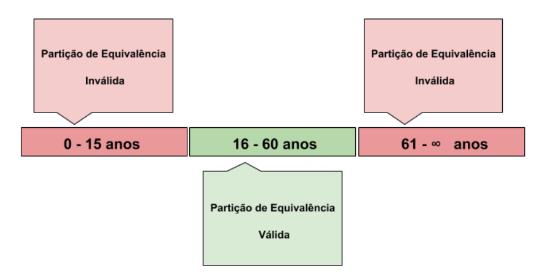

# zupedu-testes-unidade-reveladores-bug

[](https://github.com/adrianoavelino)

[](https://github.com/my-study-area/zupedu-testes-unidade-reveladores-bug/commits/main)

Testes de Unidade Reveladores de Bugs

# Aplicando Testes de Unidade Reveladores de Bugs
## Teorias necessarias
### 1 - [Aprendendo sobre Specification Test](https://github.com/zup-academy/materiais-publicos-treinamentos/blob/main/testes-de-unidade-reveladores-de-bugs/specification-test.md)

Pensar em possíveis casos de testes baseados na especificação
- Identificação dos parametros de entrada. _Ex: identificador de aluno_
- Identificação das caractertisticas dos parametros de entrada. _Ex: o identificador é valor numérico inteiro e maior que zero_.
- Adicionando restrições a partir das caracteristicas das entradas e diminuindo o conjunto de testes. _Ex: não aceita valores nulos_
- Combinando valores de entrada e obtendo casos de testes. _Ex: identificador menor que 1 e identificador nulo; identificador positivo com mais de um ano e identificador positivo com menos de um ano_

**Partições de equivalencia**
- também conhecidas como classes de equivalência
- Partições de equivalencia se dividem em:
  - partição de equivalência válida
  - partição de equivalência inválida


fonte: [Técnica de Teste — Particionamento de Equivalência](https://medium.com/revista-tspi/t%C3%A9cnica-de-teste-particionamento-de-equival%C3%AAncia-d32a7d689d82)


[Vídeo no youtube: O que é partição de equivalência: o guia definitivo
](https://www.youtube.com/watch?v=-IdzE1GoC-g&ab_channel=JuliodeLima)

### 2 - [Aprendendo sobre Boundary Test](https://github.com/zup-academy/materiais-publicos-treinamentos/blob/main/testes-de-unidade-reveladores-de-bugs/boundary-test.md)
- visa encontrar os limites das classes de entradas. _Por - exemplo, na maioridade, os valores que são igual ou maiores que de 18, como: 18, 19, 25, 34 e 76 e sem maioridade, os valores que por natureza são menores que 18, como: 1, 2, 3, 16 e 17_
- para encontrar os limites utilizams alguns conceitos como: `point, offpoint, inpoints e offpoints`
  - `point`: valor exato do limite. Ex: 18 anos
  - `offpoint`: valor mais próximo que invalida. ex: 17 anos
  - `inpoints`: são todos os valores válidos. Ex: 18, 19, 20, 21 ... anos
  - `offpoints`: são todos os valores inválidos. Ex: 17, 16 ... 2 anos e etc 


### 3 - [Aprendendo sobre Structural Test](https://github.com/zup-academy/materiais-publicos-treinamentos/blob/main/testes-de-unidade-reveladores-de-bugs/structural-test.md)
- Structural Test ou Testes Estruturais são testes construídos guiados pelo código-fonte
- Tem como responsabilidade garantir um critério de cobertura

Exemplo de calculo de cobertura por  método:
```
Quantidade de métodos executados pelo teste: 1

Quantidade métodos existentes na classe: 1

(1/1) * 100 = 100%
```

- Tipos de testes de cobertura:
  - Line Coverage (and statement coverage)
  - Block coverage
  - Branch/Decision coverage
  - Condition (Basic and condition+branc) coverage
  - Path coverage
  - MC/DC coverage

#### Line Coverage (Cobertura por Linhas)
- o objetivo é cobrir as linhas de codigo de determinada unidade, ao executar um teste.

Exemplo de calculo:
```
cobertura = (linhasExecutadasPorUmTeste/totalDeLinhas) * 100
```

- [ST1x_2018_Week_3_01_Structural_testing_line_coverage-video](https://www.youtube.com/watch?v=12P-UCRFanI&ab_channel=ST1xAutomatedSoftwareTestingPracticalSkills)

#### Block Coverage (Cobertura por blocos)
- visa a cobertura de código por blocos de códigos

*Bloco básico*

 São aqueles onde existem diversas operações que são executadas de maneira continua. Ex:
 ```java
public void somaDosQuadrados(int a, int b){ 
    int quadradoDeA = a*a;
    int quadradoDeB = b*b;
    int soma = quadradoDeA + quadradoDeB;
    System.out.println("Soma dos quadrados: "  + soma);
}
 ```

*Bloco de decisão*

São blocos de códigos que podem seguir caminhos diferentes quando utilizam estruturas de decisão como `if` e `else` ou de repetição como `while` e `for`. Ex:
```java
class Primo {

    public boolean isPrimo(int numero) { 
        int foiDividido = 0;

        for (int i = 1; i <= numero; i++) {
            if (numero % i == 0) {
                foiDividido++;
            }
        }

        if (foiDividido == 2) {
            return true;
        }
        return false;
    }

}
```
Exemplos de testes:
```java
@Test
@DisplayName("o número zero não deve ser primo")
void test() {
    NumeroPrimo numero = new NumeroPrimo();
    assertFalse(numero.isPrimo(0));
}

@Test
@DisplayName("o número 2 deve ser primo")
void test1() {
    NumeroPrimo numero = new NumeroPrimo();
    assertTrue(numero.isPrimo(2));
}

@Test
@DisplayName("o número 15 não deve ser primo")
void test2() {
    NumeroPrimo numero = new NumeroPrimo();
    assertFalse(numero.isPrimo(15));
}
```

- [ST1x_2018_Week_3_03_Branch_coverage-video
](https://www.youtube.com/watch?v=u0UJn1FseKY&ab_channel=ST1xAutomatedSoftwareTestingPracticalSkills)

#### Cobertura condicional ((Basic) condition coverage)
- Visa a cobertura de código baseada nas condicionais
- Alguns casos onde as condicionais fazem mais de uma verificação é necessário verificar as demais ramificações (filiais ou caminhos)

Exemplo de condicional simples:
```java
public boolean ehPositivo(int a){
    if(a > -1 ){
        return true;
    }

    return false;
}
```

Exemplo de condicional complexa:
```java
public boolean crescente(int a, int b, int c){
    if(a > b && b > c && c < a){
        return true;
    }

    return false;
}
```

Testes da condicional complexa:
```java
class CrescenteTest {
    private Crescente numero;

    @BeforeEach
    void setUp() {
        this.numero = new Crescente();
    }

    @Test
    @DisplayName("a deve ser maior que b, e b maior que c, por fim c menor que a")
    void test() {
        assertTrue(this.numero.crescente(10, 8, 5));
    }


    @Test
    @DisplayName("a deve ser menor que b, e b maior que c, por fim c maior que a")
    void test1() {
        assertFalse(this.numero.crescente(10, 20, 15));
    }

    @Test
    @DisplayName("A deve ser maior que B")
    void test2() {
        assertTrue(this.numero.crescente(25, 20, 15));
    }

    @Test
    @DisplayName("A deve ser menor que B")
    void test3() {
        assertFalse(this.numero.crescente(15, 20, 15));
    }

    @Test
    @DisplayName("B deve ser maior que C")
    void test4() {
        assertTrue(this.numero.crescente(23, 22, 15));
    }

    @Test
    @DisplayName("b deve ser menor que C")
    void test5() {
        assertFalse(this.numero.crescente(15, 20, 25));
    }


    @Test
    @DisplayName("C deve ser menor que A")
    void test6() {
        assertTrue(this.numero.crescente(23, 22, 21));
    }

    @Test
    @DisplayName("C deve ser maior que A")
    void test7() {
        assertFalse(this.numero.crescente(21, 20, 25));
    }
}

```
- [ST1x_2018_Week_3_04_Condition_coverage-video
](https://www.youtube.com/watch?v=6FlpIG7h8TQ&ab_channel=ST1xAutomatedSoftwareTestingPracticalSkills)

#### Cobertura de Caminho (Path Coverage)

- Visa criar testes apartir da combinação completa das condições de uma decisão
- Cada combinação é um caminho que deve ser exercicitado por teste
```
cobertura de caminhos = (caminhos percorridos/total de caminhos) * 100

caminhos percoridos= 2
total de camimhos = 6

cobertura de caminhos ->  (2/6) * 100 =  33,33%
```

#### MC/DC - Condição Modificada/Cobertura de decisão (Modified Condition/Decision Coverage)

- [MCDC](https://github.com/zup-academy/materiais-publicos-treinamentos/blob/main/testes-de-unidade-reveladores-de-bugs/structural-test.md#mcdc---condi%C3%A7%C3%A3o-modificadacobertura-de-decis%C3%A3o-modified-conditiondecision-coverage)

- [ST1x_2018_Week_3_06_MCDC-video](https://www.youtube.com/watch?v=bwtALQVx86w&t=5s&ab_channel=ST1xAutomatedSoftwareTestingPracticalSkills)

## Atividade obrigatórias

### Testando a função que verifica se uma palavra é um Palindromo
Existem certas palavras ou frases que quando lidas ao contrário representam a mesma coisa do que quando lidas na ordem convencional. Estas palavras são conhecidas como Palindromo, um belo exemplo de palindromo é a palavra `ovo`.

Para exercitar sua habilidade de escrita de testes de unidade reveladores de Bug, seu objetivo nesta atividade é testar a classe Palindromo que esta descrita abaixo:
```java
public class Palindromo {

    public boolean isPalindromo(String palavra) {
        if (palavra == null || palavra.isBlank()) {
            return false;
        }

        String palavraSemAcentosECaracteresEspeciais = Normalizer.normalize(palavra, Normalizer.Form.NFD)
                .replaceAll("[^\\p{ASCII}]", "")
                .toLowerCase()
                .replaceAll("[^a-z0-9]", "");

        return isPalindromoRecursive(palavraSemAcentosECaracteresEspeciais, 0,palavraSemAcentosECaracteresEspeciais.length() - 1);
    }


    private boolean isPalindromoRecursive(String palavra, int indexDaPontaEsquerdaDoArray, int indexDaPontaDireitaDoArray) {
        char[] letrasDaPalavra = palavra.toCharArray();
        char letraAtualDaPontaEsquerda = letrasDaPalavra[indexDaPontaEsquerdaDoArray];
        char letraAtualDaPontaDireita = letrasDaPalavra[indexDaPontaDireitaDoArray];

        if (indexDaPontaDireitaDoArray > 0 && letraAtualDaPontaEsquerda == letraAtualDaPontaDireita) {
            return isPalindromoRecursive(palavra, indexDaPontaEsquerdaDoArray + 1, indexDaPontaDireitaDoArray -1);
        }

        return letraAtualDaPontaEsquerda == letraAtualDaPontaDireita;

}
```
Quais foram as técnicas que você utilizou para construir a suite de testes para funcionalidade do Palindromo?

`R:` Utilizando a specification test para identificar os parâmetros de entrada com suas características e identificando as restrições como valores em branco e nulos. E Structutal Test utilizando a cobertura por bloco e a cobertural por condicional.

Quantos testes compõem sua suíte de testes?

`R:` Verificação de valor de entrada nulo ou em branco, palavras que são palíndromos com quantidadde par e ímpar de letras e palavras que não são palíndromos.

Cole aqui o link do Gist desenvolvido relativo aos casos de testes gerados a partir das técnicas e também a implementação dos casos:

`R:` [https://gist.github.com/adrianoavelinozup/00dc3da13a68298eb890af7658c56fed](https://gist.github.com/adrianoavelinozup/00dc3da13a68298eb890af7658c56fed)

Resposta do especialista: [https://gist.github.com/jordisilvazup/1f0c7c8ebdd9320fb59a3f3e8f30d4db](https://gist.github.com/jordisilvazup/1f0c7c8ebdd9320fb59a3f3e8f30d4db)

### Testando a lógica de aplicação de cupom de desconto
O `Minas Mais Ecommerce` está adicionando na sua política de vendas, o benefício de Cupom de descontos. Os cupons são gerados aleatoriamente para incentivar as compras, então diariamente diversos usuários recebem cupons para comprar algum produto com uma porcetagem de desconto.

Estes cupons possuem um tempo limite de validade, e só podem ser aplicados na compra caso aquele cupom seja do usuário contemplado e para o produto comtemplado, os desenvolvedores realizaram a implementação exposta abaixo, seu dever é testar de maneira unitária a fim de revelar bugs antes que a funcionalidade seja entregue a produção.

```java
public class Compra {
    private Usuario dono;
    private Produto produto;
    private BigDecimal valor;

    public Compra(Usuario dono, Produto produto, BigDecimal valor) {
        this.dono = dono;
        this.produto = produto;
        this.valor = valor;
    }
}


public class CupomDesconto {
    private Usuario usuario;
    private Produto produto;
    private BigDecimal porcentagem;
    private LocalDateTime validoAte;

    public boolean isValido() {
        return now().compareTo(validoAte) <= 0;
    }

    public boolean pertence(Usuario usuario) {
        return this.usuario.equals(usuario);
    }

    public boolean pertence(Produto produto) {
        return this.produto.equals(produto);
    }

    public BigDecimal getPorcentagem() {
        return porcentagem;
    }
}

public class Produto {
    private String nome;
    private BigDecimal preco;

    public Compra comprar(CupomDesconto cupom, Usuario usuario) {
        if (cupom.pertence(this) && cupom.pertence(usuario) && cupom.isValido()) {
            BigDecimal valorDesconto = preco.multiply(cupom.getPorcentagem());

            return new Compra(usuario, this, preco.subtract(valorDesconto));
        }

        return new Compra(usuario, this, preco);
    }
}

public class Usuario {
    private String nome;
    private String email;
}
```

Quais foram as técnicas que você utilizou para construir a suite de testes para funcionalidade que determina se um cupom é valido?

`R:` Conditional coverage para os testes dos métodos da classe de cupom e Modefied codition/ Decision coverage para o método compra da classe Produto

Quais foram as técnicas que você utilizou para construir a suite de testes para funcionalidade que determina se uma compra foi gerada com desconto de um cupom?

`R:` MC/DC para identificar os pares de independência, porém, como é uma decisão simples usando somente AND é facilmente previsto testar com o caso de sucesso e um teste para condição que não seja TRUE

Cole aqui o link do Gist desenvolvido relativo aos testes gerados para validar se um cupom é válido.

`R:` [https://gist.github.com/adrianoavelinozup/75c5ef635cff5e1925a12952153e5327](https://gist.github.com/adrianoavelinozup/75c5ef635cff5e1925a12952153e5327)

Resposta do especialista: [https://gist.github.com/jordisilvazup/9293a5ddffdb91fe76dc206f46a77a8d#file-cupomdescontotest-java](https://gist.github.com/jordisilvazup/9293a5ddffdb91fe76dc206f46a77a8d#file-cupomdescontotest-java)

Cole aqui o link do Gist desenvolvido relativo aos testes gerados para validar se a compra foi gerada com o desconto do cupom.

`R:` [https://gist.github.com/adrianoavelinozup/75c5ef635cff5e1925a12952153e5327#file-produtotest-java](https://gist.github.com/adrianoavelinozup/75c5ef635cff5e1925a12952153e5327#file-produtotest-java)

|Teste  | A   | B   | C   | A `and` B `and` C |
|:---:  |:---:|:---:|:---:|:---:              |
|1      |V    |V    |V    |V                  |
|2      |V    |V    |F    |F                  |
|3      |v    |F    |V    |F                  |
|4      |v    |F    |F    |F                  |
|5      |F    |V    |V    |F                  |
|6      |F    |V    |F    |F                  |
|7      |F    |F    |V    |F                  |
|8      |F    |F    |F    |F                  |

Pares:    
Teste A: {1, 5}    
Teste B: {1, 3}    
Teste C: {1, 2}    

1. `Teste 1`: cupom de desconto pertence ao usuário, ao produto e está na validade
2. `Teste 2`: cupom de desconto pertence ao usuário, ao produto e está vencido
3. `Teste 3`: cupom de desconto pertence ao usuário, não pertence ao produto e está na validade
4. `Teste 5`: cupom de desconto não pertence ao usuário, pertence ao produto e está na validade

### Testando a função de aprovar compra no Cartão de Crédito
A Edubank é uma iniciativa de trazer crédito para professores autonomos EAD, o projeto já contém alta gama de investidores e até clientes para testar suas funcionalidades em modo `BETA`.

No momento atual foi desenvolvido a funcionalidade aprovar um gasto de um professor, que é basicamente verificar se a soma dos gastos futuros com o valor do gasto é menor igual ao limite disponível no cartão. O Seu papel nesta atividade é aplicar seus conhecimentos em testes unitários a fim de encontrar o maior nível de bugs antes que a funcionalidade seja entregue em produção. O código a ser testado está descrito abaixo:
```java
public class Gasto {

    private UUID id;
    private BigDecimal valor;
    private final LocalDateTime criadoEm = LocalDateTime.now();

    public Gasto(BigDecimal valor) {
        this.id = UUID.randomUUID();
        this.valor = valor;
    }

    public UUID getId() {
        return id;
    }

    public BigDecimal getValor() {
        return valor;
    }

    public LocalDateTime getCriadoEm() {
        return criadoEm;
    }

}

public class Cartao {

    private String numero;
    private String nomeTitular;
    private String codigoSeguranca;
    private String senha;
    private BigDecimal limite;
    private List<Fatura> faturas = new ArrayList<>();
    private LocalDateTime validoAte;
    private final LocalDateTime criadoEm = LocalDateTime.now();

    public boolean isAprovado(Gasto gasto, String codigoSeguranca, String senha) {
        BigDecimal somaDasFaturasFuturas = faturas.stream()
                .filter(fatura -> fatura.getMesAno().compareTo(YearMonth.now()) >= 0)
                .map(Fatura::getValor)
                .reduce(BigDecimal.ZERO, BigDecimal::add);

        BigDecimal gastosTotais = somaDasFaturasFuturas.add(gasto.getValor());

        return gastosTotais.compareTo(limite) <= 0
                && this.codigoSeguranca.equalsIgnoreCase(codigoSeguranca)
                && this.senha.equalsIgnoreCase(senha);
    }

}

public class Fatura {

    private Cartao cartao;
    private YearMonth mesAno;
    private List<Gasto> gastos = new ArrayList<>();

    public void adicionar(Gasto gasto) {
        this.gastos.add(gasto);
    }

    public BigDecimal getValor() {
        return gastos.stream()
                .map(Gasto::getValor)
                .reduce(BigDecimal.ZERO, BigDecimal::add);
    }

    public YearMonth getMesAno() {
        return mesAno;
    }

}
```

Cole aqui o link do Gist desenvolvido relativo aos testes gerados para validar se uma compra é aprovada no cartão.

`R:` [https://gist.github.com/adrianoavelinozup/942bec10418657530bf43224355f46f4](https://gist.github.com/adrianoavelinozup/942bec10418657530bf43224355f46f4)

Resposta do especialista: [https://gist.github.com/jordisilvazup/1ad98b3479bb0f9e8513c1431b19f7c7](https://gist.github.com/jordisilvazup/1ad98b3479bb0f9e8513c1431b19f7c7)

### Testando a funçãoo que verifica se um número é Primo

Os números primos são aqueles que apresentam apenas dois divisores: um e o próprio número. Eles fazem parte do conjunto dos números naturais.
Por exemplo, 2 é um número primo, pois só é divisível por um e ele mesmo.

Quando um número apresenta mais de dois divisores eles são chamados de números compostos e podem ser escritos como um produto de números primos.

Dado a implementação descrita abaixo, sua missão é implementar testes de unidade com intuito de revelar a maior quantidade de
bugs.

```java
public class NumeroPrimo {

    public boolean primo(int numero) {
        return primo(numero, 1, 0);
    }

    boolean primo(int numeroInicial, int numeroVariavel, int qtdDividido) {
        if (numeroInicial == 0 || numeroInicial == -1 || numeroInicial == 1) {
            return false;
        }

        if (numeroInicial % numeroVariavel == 0 && numeroInicial != numeroVariavel) {
            return primo(numeroInicial, numeroVariavel + 1, qtdDividido + 1);

        }

        if (numeroInicial % numeroVariavel != 0 && numeroVariavel <= numeroInicial) {
            return primo(numeroInicial, numeroVariavel + 1, qtdDividido);
        }
        return numeroInicial % numeroVariavel == 0 
        && qtdDividido + 1 == 2 && numeroInicial == numeroVariavel;
    }

}
```

Cole aqui o link do Gist desenvolvido relativo aos testes gerados para validar se um número é primo

`R:` [https://gist.github.com/adrianoavelinozup/18e94ed9c7f9b024462e33f1fef82690](https://gist.github.com/adrianoavelinozup/18e94ed9c7f9b024462e33f1fef82690)

Resposta do especialista: [https://gist.github.com/jordisilvazup/e1b4e61c233cb5922ad60ed7d18208be](https://gist.github.com/jordisilvazup/e1b4e61c233cb5922ad60ed7d18208be)

### Testando a função que realiza exponenciação de forma recursiva
A potenciação ou exponenciação é a operação matemática que representa a multiplicação de fatores iguais. Ou seja, usamos a potenciação quando um número é multiplicado por ele mesmo várias vezes.
Para escrever um número na forma de potenciação usamos a seguinte notação: `a^n= a*a*a*a;`

Uma implementação desta função esta abaixo.

```java
public class ExponenciacaoRecursiva {

      public double exponenciar(int base, int expoente) {
        if (expoente == 0) {
            return 1;
        }
        if (expoente == -1) {
            return 1.0 / base;
        }

        if (expoente == 1) {
            return (double) base;
        }

        if (base == 1) {
            return 1;
        }

        if (base == -1) {
            return expoente % 2 == 0 ? 1 : -1;
        }

        return exponenciar((double) base, (double) expoente, 1);
    }

    double exponenciar(double base, double expoente, double resultado) {
        if (expoente < 0) {
            double baseInvertida = 1 / base;
            double expoenteComSinalInvertido = expoente * -1;
            return exponenciar(baseInvertida, expoenteComSinalInvertido - 1, resultado * baseInvertida * baseInvertida);
        }

        if (base < 0 && expoente % 2 == 0 && resultado == 1) {
            double baseComSinalInvertido = base * -1;
            return exponenciar(baseComSinalInvertido, expoente - 1, resultado * baseComSinalInvertido * baseComSinalInvertido);
        }

        if (resultado == 1) {
            return exponenciar(base, expoente - 1, resultado * base * base);
        }

        if (expoente == 1) {
            return resultado;
        }

        return exponenciar(base, expoente - 1, resultado * base);
    }

}
```
Cole aqui o link do Gist desenvolvido relativo aos testes gerados para funcionalidade realiza a exponenciação de dois números de forma recursiva?

`R:` [https://gist.github.com/adrianoavelinozup/32de2c103052f1b226e8b117fe21bdf3](https://gist.github.com/adrianoavelinozup/32de2c103052f1b226e8b117fe21bdf3)

Resposta do especialista: [https://gist.github.com/jordisilvazup/3eb23420bbc740a2bc23dd881396ba8c](https://gist.github.com/jordisilvazup/3eb23420bbc740a2bc23dd881396ba8c)
